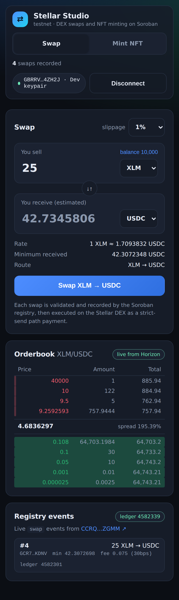
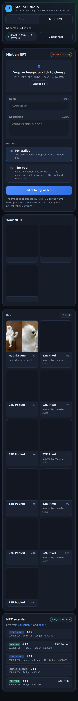
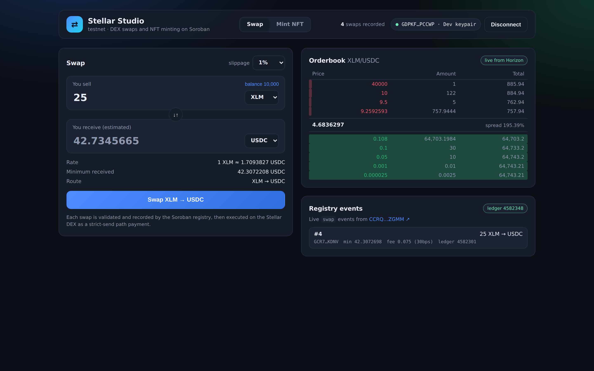
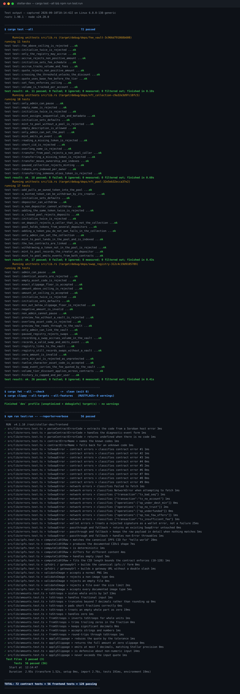

# Stellar Studio

**Swap tokens and mint NFTs on Stellar — four Soroban smart contracts, live on testnet.**

[](https://github.com/TranHuyHiep/Stellar-Dex/actions/workflows/ci.yml)
[](https://github.com/TranHuyHiep/Stellar-Dex/actions/workflows/deploy-frontend.yml)


---

## What is this?

Two small apps sharing one codebase, both talking to smart contracts that are
actually deployed and running:

| | What you can do | What happens underneath |
| --- | --- | --- |
| 💱 **Swap** | Trade XLM ↔ USDC ↔ EURC at live market rates | A `swap_registry` contract checks the trade and asks a separate `fee_vault` contract what the fee should be — then the trade settles on Stellar's real orderbook |
| 🖼️ **Mint NFT** | Upload an image, mint it as an NFT | The image goes to IPFS, the reference goes on chain, and the NFT can be minted straight into a `nft_pool` contract that holds it for you |

**The interesting part** is that the contracts call *each other*. One click, one
transaction, two contracts running — and you can see events from both.

## Try it

**Live demo:** <TODO: paste the Vercel URL — see [DEPLOYMENT.md](DEPLOYMENT.md)>

**No wallet needed.** Click **Dev key → Create + fund** and you get a funded
testnet account instantly. Nothing here touches real money — it is all Stellar
testnet.

**Demo video (90s):** <TODO: paste the Loom/YouTube link — script in [DEMO.md](DEMO.md#demo-video-90-seconds)>

Or run it locally in three commands:

```bash
git clone https://github.com/TranHuyHiep/Stellar-Dex.git
cd Stellar-Dex/frontend && npm install
npm run dev          # → http://localhost:5173
```

## Contents

| Section | |
| --- | --- |
| [Screenshots](#screenshots) | What it looks like on phone and desktop |
| [Deployed contracts](#deployed-contracts-testnet) | The four addresses, live on testnet |
| [Architecture](#architecture) | How the pieces fit together |
| [The contracts](#the-contracts) | What each contract does |
| [Verified on testnet](#verified-on-testnet) | Real transaction hashes you can click |
| [Testing](#testing) | 128 tests and how to run them |
| [Running it](#running-it) | Full setup, including the contracts |
| [Submission checklist](#submission-checklist) | For reviewers |

---

## Screenshots

Captured by [`frontend/screenshots.mjs`](frontend/screenshots.mjs) against the
contracts listed below, so what you see is the live deployment rather than a
mock-up. Regenerate them any time with `npm run screenshots`.

### Mobile

| Swap — 390 × 844 | Mint NFT — 390 × 844 |
| --- | --- |
|  |  |

A live Horizon quote and orderbook on the left; the mint form, your NFTs and
the pool's holdings on the right. Both fit a phone with no horizontal scroll.

### Desktop



*1440 × 900.*

Note the **Registry events** panel: swap `#4`, `fee 0.075 (30bps)`, ledger
4582301. That fee was quoted by `fee_vault` during the same invocation that
`swap_registry` recorded — the cross-contract call, visible from the outside.

### Tests



All 128 tests, named individually — 72 across the four contracts and 56 in the
frontend. This is [`docs/test-output.txt`](docs/test-output.txt) typeset in a
terminal frame; every line comes from a real run. Reproduce it with
`cargo test --all` and `npx vitest run --reporter=verbose`.

### CI pipeline

Every push runs [`ci.yml`](.github/workflows/ci.yml) (contracts: fmt, clippy,
72 tests, wasm build · frontend: typecheck, lint, 56 tests, build) and
[`deploy-frontend.yml`](.github/workflows/deploy-frontend.yml). Both are green
on `main` — the badges at the top of this file link straight to the runs, and
the full history is in the
[Actions tab](https://github.com/TranHuyHiep/Stellar-Dex/actions).

> A screenshot of the Actions tab (`images/ci-pipeline.png`) still has to be
> captured by hand from the browser — the badges above are live, but they are
> not the same thing as the screenshot the submission asks for.

---

## Deployed contracts (testnet)

| Contract | Address |
| --- | --- |
| `swap_registry` | [`CCRQPERNC67KO2QLWDUAGBC5GAGL5JEC4HCM5HQIXVCXT7QU7FQLZGMM`](https://stellar.expert/explorer/testnet/contract/CCRQPERNC67KO2QLWDUAGBC5GAGL5JEC4HCM5HQIXVCXT7QU7FQLZGMM) |
| `fee_vault` | [`CC6AATAR2D2M6J6BQL6E7DXNS25THEVX76363DSPCFNKG2Y3U6J3IUY4`](https://stellar.expert/explorer/testnet/contract/CC6AATAR2D2M6J6BQL6E7DXNS25THEVX76363DSPCFNKG2Y3U6J3IUY4) |
| `nft_collection` | [`CBMIQ343QRVOUGXE7OUPCZNNYGWBDWMS56UALN5NIHWZALN6IDYYYEUV`](https://stellar.expert/explorer/testnet/contract/CBMIQ343QRVOUGXE7OUPCZNNYGWBDWMS56UALN5NIHWZALN6IDYYYEUV) |
| `nft_pool` | [`CBADR5KPKYFMMMMOUWYIZXZ4NZGRWTNPJEUQN6OLGU52OLWALT2CKTZG`](https://stellar.expert/explorer/testnet/contract/CBADR5KPKYFMMMMOUWYIZXZ4NZGRWTNPJEUQN6OLGU52OLWALT2CKTZG) |

All four are recorded in [`deployment.json`](deployment.json), which
[`scripts/deploy.sh`](scripts/deploy.sh) writes after deploying and linking them.

## Level 3 requirements

| Requirement | Where it lives |
| --- | --- |
| **Advanced smart contract development** | Four contracts: typed error enums (up to 11 variants), `#[contractevent]` typed events, instance vs. persistent storage, `require_auth` admin gates, bounded per-owner indexes, pause/close killswitches, checked arithmetic — [`swap_registry`](contracts/swap_registry/src/lib.rs), [`fee_vault`](contracts/fee_vault/src/lib.rs), [`nft_collection`](contracts/nft_collection/src/lib.rs), [`nft_pool`](contracts/nft_pool/src/lib.rs) |
| **Inter-contract communication** | Two pairs, via `#[contractclient]`. `record_swap` → `fee_vault.quote_fee` + `accrue`; `mint_to_pool` → `nft_pool.on_deposit`, and `nft_pool.add`/`withdraw` → `nft_collection.transfer` — calls run in **both** directions |
| **Event streaming & real-time updates** | `swap` events and NFT `mint`/`transfer`/`deposit`/`withdraw` events polled into live feeds; Horizon orderbook on a 6s tick — [`EventFeed.tsx`](frontend/src/components/EventFeed.tsx), [`NftEventFeed.tsx`](frontend/src/components/NftEventFeed.tsx) |
| **CI/CD pipeline setup** | [`ci.yml`](.github/workflows/ci.yml) — fmt, clippy, tests, wasm build, frontend typecheck/lint/test/build |
| **Smart contract deployment workflow** | [`scripts/deploy.sh`](scripts/deploy.sh) and manual-only [`deploy.yml`](.github/workflows/deploy.yml) |
| **Mobile responsive frontend** | Phone/tablet breakpoints on both pages, 44px touch targets, 16px inputs (no iOS zoom), safe-area insets, responsive NFT grid — verified 0 overflow at 375/390/768px |
| **Error handling & loading states** | Four error classes, shimmer skeletons, spinners, upload progress — [`errors.ts`](frontend/src/lib/errors.ts), [`OrderBookView.tsx`](frontend/src/components/OrderBookView.tsx), [`ImageDropzone.tsx`](frontend/src/components/ImageDropzone.tsx) |
| **Tests for contracts and frontend** | 72 Rust tests (25 of them cross-contract), 56 Vitest assertions, 3 Playwright e2e suites |
| **Production-ready architecture** | Env-driven config, layered `lib/`, retry/propagation handling, mutual contract authorisation |
| **Documentation & demo** | This file, plus [`DEMO.md`](DEMO.md) |
| **Token / NFT minting** | [`nft_collection`](contracts/nft_collection/src/lib.rs) + a dedicated [mint page](frontend/src/pages/MintPage.tsx) with IPFS image upload |

---

## Architecture

```
                        ┌──────────────────────────────┐
                        │        React swap UI         │
                        └──────────────────────────────┘
             orderbook +      │           │            │  swap events
             strict-send      │           │ record_swap│  (polled)
             quotes           ▼           ▼            ▼
                      ┌────────────┐  ┌──────────────────────────┐
                      │  Horizon   │  │   Soroban RPC (testnet)  │
                      │ (classic   │  │                          │
                      │  DEX)      │  │  ┌────────────────────┐  │
                      └────────────┘  │  │   swap_registry    │  │
                             ▲        │  │  · validates       │  │
                             │        │  │  · counts, history │  │
                             │        │  │  · emits SwapEvent │  │
                             │        │  └─────────┬──────────┘  │
                             │        │            │ cross-      │
                             │        │            │ contract    │
                             │        │            ▼             │
                             │        │  ┌────────────────────┐  │
                             │        │  │     fee_vault      │  │
                             │        │  │  · quote_fee       │  │
                             │        │  │  · accrue (volume) │  │
                             │        │  │  · emits Accrued   │  │
                             │        │  └────────────────────┘  │
                             │        └──────────────────────────┘
            path_payment_strict_send
            (the actual swap settles here)
```

Two ledgers, two purposes: the **classic DEX** provides liquidity and the real
orderbook; the **Soroban contracts** are the programmable guard rail.

Splitting the contracts is the point of the second one. The registry decides
whether a swap is *allowed*; the vault decides what it *costs*. Fee policy can
change — new rates, new tiers — without redeploying the registry that holds the
swap history.

### Swap flow

1. **Validate** in the browser (amount, distinct assets, balance, asset codes).
2. **Quote** via Horizon `strict_send_paths` — the real route and amount.
3. **Trustline** for the destination asset, created if missing.
4. **Registry** — `record_swap` is simulated, signed and submitted. Inside that
   one invocation it calls into `fee_vault` twice. A typed contract error here
   costs nothing, because simulation rejects it before submission.
5. **DEX swap** — `path_payment_strict_send` with `destMin` from the slippage.

Steps 4 and 5 are two separate transactions, so a swap can be recorded and then
fail at the DEX step; the UI names the stage that failed and links both. Making
it atomic would mean routing funds through a Soroban contract, which gives up
the classic orderbook and its liquidity.

### NFT pair

```
                    ┌──────────────────────────────┐
                    │      React mint page         │
                    └──────────────────────────────┘
          image  │              │ mint / mint_to_pool  │ events
                 ▼              ▼                      ▼
          ┌────────────┐  ┌────────────────────────────────────┐
          │   IPFS     │  │       Soroban RPC (testnet)        │
          │ (Pinata,   │  │  ┌──────────────────┐              │
          │  or CID    │  │  │  nft_collection  │              │
          │  computed  │  │  │ · name/desc/CID  │              │
          │  locally)  │  │  │ · owner index    │              │
          └────────────┘  │  │ · emits Mint     │              │
                          │  └───┬──────────▲───┘              │
                          │      │on_deposit│transfer          │
                          │      ▼          │                  │
                          │  ┌──────────────┴───┐              │
                          │  │     nft_pool     │              │
                          │  │ · custodies NFTs │              │
                          │  │ · depositor map  │              │
                          │  │ · emits Deposit  │              │
                          │  └──────────────────┘              │
                          └────────────────────────────────────┘
```

Unlike the swap pair, this one calls in **both** directions: the collection
notifies the pool when minting into it, and the pool asks the collection to move
tokens when depositing or withdrawing. Ownership always changes in the
collection first, so the pool's index cannot claim a token it does not hold.

### Mint flow

1. **Upload** the image. Validated for type and size in the browser, then
   pinned to IPFS — or, with no pinning key, hashed locally into a real CIDv1.
2. **Name and describe** it, with counters mirroring the contract's bounds.
3. **Choose a destination**:
   * *My wallet* — `mint(to, name, desc, cid)`, one contract.
   * *The pool* — `mint_to_pool(creator, …)`, which mints the token already
     owned by the pool and calls `on_deposit` on it in the same transaction.
4. Later, **`add`** an owned NFT into the pool, or **`withdraw`** one you
   deposited.

---

## The contracts

### `swap_registry`

```rust
pub enum Error {
    NotInitialized = 1,   AlreadyInitialized = 2,
    InvalidAmount = 3,    SlippageTooHigh = 4,
    IdenticalAssets = 5,  RegistryPaused = 6,
    AmountTooLarge = 7,   Unauthorized = 8,
    InvalidAsset = 9,     VaultNotSet = 10,
}
```

| Function | Purpose |
| --- | --- |
| `initialize(admin)` | Set the admin; rejects a second call |
| `record_swap(user, sell, buy, amount_in, min_out)` | Validate, quote+accrue through the vault, count, store history, emit `SwapEvent` |
| `set_fee_vault(caller, vault)` | Admin-only; links the vault |
| `preview_fee(user, amount)` | Reads through to the vault |
| `history(user)` / `total_swaps()` / `user_swaps(user)` | Read state |
| `set_paused(caller, value)` | Admin-only killswitch |

### `fee_vault`

```rust
pub enum Error {
    NotInitialized = 1,     AlreadyInitialized = 2,
    FeeTooHigh = 3,         UnauthorizedCaller = 4,
    InvalidAmount = 5,
}
```

| Function | Purpose |
| --- | --- |
| `initialize(admin, base_fee_bps, discount_fee_bps)` | Fee schedule, capped at 5% |
| `set_registry(registry)` | Admin-only; the only address allowed to `accrue` |
| `quote_fee(user, amount)` | Pure read: bps, absolute fee, whether the tier applies |
| `accrue(caller, user, amount, asset)` | Registry-only; records volume, emits `Accrued` |
| `volume_of(user)` / `total_volume()` / `total_fees()` | Read state |

### `nft_collection`

```rust
pub enum Error {
    NotInitialized = 1,      AlreadyInitialized = 2,
    Unauthorized = 3,        TokenNotFound = 4,
    InvalidName = 5,         InvalidDescription = 6,
    InvalidCid = 7,          NotOwner = 8,
    PoolNotSet = 9,          OwnerTokenLimit = 10,
    MintingPaused = 11,
}
```

| Function | Purpose |
| --- | --- |
| `mint(to, name, description, cid)` | Mint to an account; `to` must authorise |
| `mint_to_pool(creator, name, description, cid)` | Mint owned by the pool, then notify it |
| `transfer(from, to, token_id)` | Move a token you own |
| `transfer_from_pool(pool, to, token_id)` | Pool-only; used for withdrawals |
| `metadata_of(id)` / `owner_of(id)` / `tokens_of(owner)` | Read state |
| `set_pool(caller, pool)` / `set_paused(caller, value)` | Admin-only |

Metadata is bounded on chain: name 1–64 characters, description ≤256, CID
10–128. The per-owner token index is capped so reads stay bounded.

### `nft_pool`

```rust
pub enum Error {
    NotInitialized = 1,     AlreadyInitialized = 2,
    Unauthorized = 3,       CollectionNotSet = 4,
    AlreadyInPool = 5,      NotInPool = 6,
    NotDepositor = 7,       PoolFull = 8,
    PoolClosed = 9,
}
```

| Function | Purpose |
| --- | --- |
| `on_deposit(caller, token_id, depositor)` | Collection-only; indexes a minted token |
| `add(owner, token_id)` | Pull an owned token in through the collection |
| `withdraw(to, token_id)` | Return a token to the account that deposited it |
| `items()` / `size()` / `contains(id)` / `depositor_of(id)` | Read state |
| `set_collection(caller, c)` / `set_closed(caller, v)` | Admin-only |

`on_deposit` being collection-only is the load-bearing check: without it anyone
could tell the pool it holds a token it does not own.

### Inter-contract communication

The registry declares only the slice of the vault it needs, rather than
importing the crate, so the two stay independently deployable:

```rust
#[contractclient(name = "FeeVaultClient")]
pub trait FeeVaultInterface {
    fn quote_fee(env: Env, user: Address, amount: i128) -> FeeQuote;
    fn accrue(env: Env, caller: Address, user: Address, amount: i128, asset: String) -> i128;
}
```

The trust is **mutual and explicit**: the registry stores the vault's address
(admin-only), and the vault stores the registry's (admin-only) and rejects
`accrue` from anyone else with `UnauthorizedCaller`. The registry passes
`env.current_contract_address()` as `caller`, so the vault authorises the
*contract*, not the end user.

The registry also stays useful unlinked — no vault means fees are skipped, not
an error — so the dependency is an enhancement rather than a hard requirement.

---

## Testing

```bash
cargo test                  # 72 tests across four contracts
cd frontend && npm run test:run   # 56 Vitest assertions
```

| Crate | Tests | Notes |
| --- | --- | --- |
| `swap_registry` | 26 | 8 register the real `fee_vault` |
| `fee_vault` | 11 | fee tiers, ceiling, caller authorisation |
| `nft_collection` | 18 | metadata bounds, transfers, pause |
| `nft_pool` | 17 | all against the real collection, not a stub |

**Contract tests** cover every error path, the slippage boundary, history
capping and admin authorisation. The cross-contract tests register the real
counterpart contract in the test host, so they exercise the same code path as
on chain: a swap accruing volume in the vault, the tier discount applying
across the boundary, a mint landing in the pool with both contracts emitting,
and a deposit rejected when the caller does not own the token.

**Frontend unit tests** cover the error taxonomy (every contract code and the
Stellar operation result codes), the stroop/slippage maths including the
truncate-not-round rule that keeps `min_out` reachable, and the IPFS CID
derivation — pinned against the canonical `bafkreifzjut3te…` vector for
"hello world", because if that drifts the CIDs written on chain stop being real
content addresses.

Writing these caught a real bug: `tx_insufficient_fee` was matching a broader
`insufficient` pattern meant for balance errors, so a fee problem reported
"insufficient balance".

**End-to-end** (needs a dev server, spends testnet XLM):

```bash
npm run e2e:swap      # connect -> quote -> registry -> DEX, asserts success
npm run e2e:mint      # upload -> mint -> deposit -> mint into pool
npm run e2e:errors    # asserts all error classes render
```

---

## Error handling

Four classes, each with its own label, message and expandable detail.

**1. Validation** — caught in the UI, no network call:

```
Pick two different assets.
Insufficient XLM balance (you have 10000).
```

**2. Contract** — a typed `Error(Contract, #N)`, mapped to plain language:

```
CONTRACT ERROR · #3   Invalid amount — the sell amount must be greater than zero.
CONTRACT ERROR · #4   Slippage too high — below the registry's limit (max 10%).
CONTRACT ERROR · #5   Identical assets — pick two different tokens.
CONTRACT ERROR · #6   Registry is paused by its admin.
```

**3. Network / DEX** — Horizon or RPC unreachable, plus specific Stellar result
codes (`op_under_dest_min`, `op_no_trust`, `op_underfunded`,
`op_too_few_offers`, `tx_bad_seq`, `tx_no_account`, `tx_insufficient_fee`, …).

**4. Wallet** — a cancelled signature is its own class, so declining never
looks like a failure.

### Loading states

Shimmer skeletons match the shape of the content they replace (the orderbook's
three-column rows, the feed's item height) so the layout doesn't jump. Spinners
mark the submit button, the quote field, and the live pills. The event feed
distinguishes "still loading" from "no swaps yet".

---

## Verified on testnet

> Soroban RPC exposes no SSE endpoint, so both feeds poll `getEvents` every 7s
> over a bounded ledger window. An empty feed usually means the last swap was
> simply older than that window, not that anything is broken — run a swap and
> it repopulates.

A single `record_swap` invocation produced events from **both** contracts:

```
fee_vault      accrued  { amount: 1000000000, fee: 3000000, total_volume: 1000000000 }
swap_registry  swap     { amount_in: 1000000000, fee_bps: 30, fee_amount: 3000000,
                          sell_asset: XLM, buy_asset: USDC, swap_index: 1 }
```

A full swap driven through the browser against live testnet:

```
CONNECTED: GCZRF…LHOVO · Dev keypair
QUOTE:     25 XLM → 44.8192760 USDC
RESULT:    SUCCESS (registry swap #2)
```

### Transaction hashes

Every hash below was submitted by the browser against live testnet and checked
against Horizon (`successful: true`) before being listed here. Click any of
them to open the explorer.

**Swap pair** — `swap_registry` → `fee_vault`:

| Action | Contracts executed | Ledger | Transaction |
| --- | --- | --- | --- |
| `record_swap` — validate, quote the fee, accrue volume | `swap_registry` **+** `fee_vault` | 4582301 | [`210ba4c2…04e24`](https://stellar.expert/explorer/testnet/tx/210ba4c203fe2ea1b356f0c477a50dd33e5bc47b76e9271d756bff2746704e24) |
| `path_payment_strict_send` — the swap itself | classic DEX orderbook | 4582302 | [`c3d6f725…52c60`](https://stellar.expert/explorer/testnet/tx/c3d6f7253de7038c70bd4174550a306224da4336ccd5b02a11549ebc44952c60) |

**NFT pair** — `nft_collection` ↔ `nft_pool`:

| Action | Events emitted | Ledger | Transaction |
| --- | --- | --- | --- |
| `mint` — NFT #11 to the wallet | `mint` (collection) | 4582329 | [`f637f571…2b569`](https://stellar.expert/explorer/testnet/tx/f637f57167ceb5ab08bbfbff92e450dfc07f504d7cf9a8f16af25f312b22b569) |
| `add` — deposit #11 into the pool | `transfer` (collection) **+** `deposit` (pool) | 4582331 | [`667b1f71…0e666`](https://stellar.expert/explorer/testnet/tx/667b1f711799f3d01155a286031ba5959f1402ed438a792d67f10910e430e666) |
| `mint_to_pool` — NFT #12 straight into the pool | `mint` (collection) **+** `deposit` (pool) | 4582333 | [`9d0ab21f…5f685`](https://stellar.expert/explorer/testnet/tx/9d0ab21ff3713d21e7c1975341d3fa2aad9a25fd0587d3b4c074657ad6d5f685) |

The three bolded rows are the point of the architecture: **one** submitted
transaction, **two** contracts executed, events from both. Read them straight
off the RPC rather than taking this table's word for it:

```bash
stellar events --network testnet --start-ledger 4582325 \
  --id CBMIQ343QRVOUGXE7OUPCZNNYGWBDWMS56UALN5NIHWZALN6IDYYYEUV \
  --id CBADR5KPKYFMMMMOUWYIZXZ4NZGRWTNPJEUQN6OLGU52OLWALT2CKTZG
```

`667b1f71…` and `9d0ab21f…` each appear **twice** in that output, once per
contract, with a single shared `txHash` — which is what a cross-contract call
looks like from the outside.

Or verify a single transaction with nothing but curl:

```bash
curl -s https://horizon-testnet.stellar.org/transactions/\
210ba4c203fe2ea1b356f0c477a50dd33e5bc47b76e9271d756bff2746704e24 | jq '.successful, .ledger'
```

<details>
<summary>Earlier run, kept for reference</summary>

The first documented swap, ledgers 4088584 / 4088585 — still live:
[`0a8085d7…c0b7c2`](https://stellar.expert/explorer/testnet/tx/0a8085d746a8e72cb559f1047dfaa40c464e068d552743efc760a79aa7c0b7c2)
(registry + vault) and
[`e72d85e5…4b6d03`](https://stellar.expert/explorer/testnet/tx/e72d85e5353bb6ca3803be92a8ec9a767d07db9c00e5dba580170d6b1c4b6d03)
(DEX). Soroban RPC only serves events for a limited ledger window, so these no
longer show up in the in-app feed — the transactions themselves are permanent.

</details>

The vault's totals then read `total_volume: 1250000000`, `total_fees: 3750000` —
exactly 30 bps of both swaps.

The NFT pair, likewise in single invocations:

```
mint_to_pool:
  nft_collection  mint     { token_id: 1, name: "Nebula One", to_pool: true }   owner = pool
  nft_pool        deposit  { token_id: 1, minted: true, pool_size: 1 }

add (deposit an owned token):
  nft_collection  transfer { token_id: 2, to: <pool> }
  nft_pool        deposit  { token_id: 2, minted: false, pool_size: 2 }

withdraw:
  nft_collection  transfer { token_id: 2, to: <depositor> }
  nft_pool        withdraw { token_id: 2, pool_size: 1 }
```

Driven through the browser (`e2e-mint.mjs`) against live testnet:

```
CID:               bafkreie5jowcuvh46tyddyq7cgggmv7vrl3pdwexb2salleeux3dnc5uzm
mint-to-self:      SUCCESS — Minted NFT #5 to your wallet.
add-to-pool:       SUCCESS — NFT #5 is now held by the pool.
mint-to-pool:      SUCCESS — Minted NFT #6 straight into the pool.
CONSOLE ERRORS:    none
```

Error paths were also exercised directly against the deployed contracts:

| Call | Result |
| --- | --- |
| `initialize` (second time) | `Error(Contract, #2)` |
| `record_swap` with `amount_in = 0` | `Error(Contract, #3)` |
| `record_swap` with `min_out` at 50% | `Error(Contract, #4)` |
| `record_swap` with `XLM → XLM` | `Error(Contract, #5)` |
| `accrue` from a non-registry address | `Error(Contract, #4)` (vault) |
| `on_deposit` from a non-collection address | `Error(Contract, #3)` (pool) |
| `add` a token you do not own | rejected by the collection, nothing indexed |
| `withdraw` as a non-depositor | `Error(Contract, #7)` (pool) |

---

## IPFS

Images are content-addressed, not stored on chain — the contract holds only the
CID.

**With a pinning key.** Set `VITE_PINATA_JWT` and uploads are pinned through
Pinata; the returned CID resolves on any IPFS gateway.

**Without one.** The mint page still works. The file is hashed in the browser
into a genuine CIDv1 (`raw` codec, sha2-256, base32 multibase — the identifier
`ipfs add --cid-version=1 --raw-leaves` would produce) and previewed from a blob
URL. So the CID recorded on chain is always a real content address; only the
pinning is skipped, and the UI says so with an "IPFS not pinning" badge. Images
whose CID was never pinned show a placeholder in the galleries rather than a
broken-image icon.

The derivation is unit-tested against the canonical vector for "hello world",
so a regression here fails the build rather than silently writing meaningless
CIDs on chain.

---

## Running it

### Prerequisites

- Node 20+
- Rust with the `wasm32v1-none` target
- [Stellar CLI](https://github.com/stellar/stellar-cli) and `jq` (only to deploy)

### Frontend

```bash
cd frontend
npm install
npm run dev          # http://localhost:5173
```

Two pages: **Swap** at `/` and **Mint NFT** at `/mint`. They share one wallet
connection, so switching pages does not disconnect you.

The deployed addresses are the defaults in
[`config.ts`](frontend/src/lib/config.ts), so this works with no `.env` file.
To point at a different deployment, or to add a Pinata key for real IPFS
pinning, copy `.env.example` to `.env.local`.

Connect any supported wallet (Freighter, xBull, Albedo, Rabet, Lobstr, Hana),
or click **Dev key → Create + fund** for a Friendbot-funded testnet account.

> Dev-keypair mode keeps a secret key in `localStorage`. Testnet convenience
> only — never paste a mainnet secret.

### Deploying

```bash
./scripts/deploy.sh testnet deployer
```

Builds all four contracts, uploads and instantiates them, initializes each,
links both pairs in **both** directions, verifies every link, and writes
`deployment.json`.

Neither contract has a constructor, so `initialize` must be called explicitly —
passing `--admin` to `stellar contract deploy` is silently ignored.

The script retries the transient RPC failures that otherwise break a
multi-transaction deploy: stale sequence numbers (`TxBadSeq`), `Wasm does not
exist` when the upload hasn't settled, `Contract not found` before the instance
is indexed, and connection resets.

---

## Layout

```
contracts/
  swap_registry/     registry: validation, events, storage, vault client (26 tests)
  fee_vault/         fee policy + volume accounting (11 tests)
  nft_collection/    NFT metadata, ownership, mint-to-pool (18 tests)
  nft_pool/          NFT custody, depositor tracking (17 tests)
frontend/src/
  App.tsx             router shell
  WalletContext.tsx   one wallet connection shared by both pages
  pages/SwapPage.tsx  the DEX swap UI
  pages/MintPage.tsx  IPFS upload + NFT mint + pool
  lib/config.ts       env-driven network + contract addresses
  lib/errors.ts        the four-class error taxonomy
  lib/horizon.ts       orderbook, quotes, balances, trade stream
  lib/contract.ts      Soroban invoke + event polling
  lib/swap.ts          path payment, trustline, sequence handling
  lib/wallet.ts        multi-wallet + dev keypair
  lib/nft.ts           NFT + pool client, event polling
  lib/ipfs.ts          upload, validation, local CIDv1 derivation
  lib/*.test.ts        Vitest unit tests
  components/          SwapForm, OrderBookView, TxStatus, EventFeed, WalletBar,
                       ImageDropzone, NftGallery, NftEventFeed
frontend/e2e-*.mjs     Playwright suites against live testnet
scripts/deploy.sh      deploy + link + verify
.github/workflows/     ci.yml (push/PR), deploy.yml (manual)
deployment.json        deployed addresses and fee policy
DEMO.md                demo script
```

---

## Production-ready practices

- **Config over constants.** Network, RPC and contract addresses come from Vite
  env vars, so one build artifact can target several environments.
- **Mutual authorisation.** Neither contract implicitly trusts the other; each
  stores the other's address behind an admin check.
- **Propagation is handled, not hoped for.** Horizon and the Soroban RPC index
  ledgers independently. A swap spans three transactions, so account state is
  read from both and built on the higher sequence number, with retries that wait
  for the sequence to advance rather than sleeping a fixed interval. This was a
  real intermittent failure (`txBadSeq` / `txNoAccount`), not a theoretical one.
- **Simulate before submitting.** Contract errors surface during simulation, so
  a rejected swap costs the user no fee.
- **CI gates on warnings.** `RUSTFLAGS: -D warnings` plus `cargo fmt --check`
  and clippy, so lint debt cannot accumulate.
- **Deploys are deliberate.** The deploy workflow is manual-only, environment-
  scoped, and serialised by a concurrency group.

---

## Submission checklist

| Required | Where |
| --- | --- |
| Public GitHub repository | <https://github.com/TranHuyHiep/Stellar-Dex> |
| README with complete documentation | this file |
| Minimum 10+ meaningful commits | `git log --oneline` — 19 |
| Live demo link | **[Try it](#try-it)** — ⚠️ paste the URL after the first Vercel deploy ([DEPLOYMENT.md](DEPLOYMENT.md)) |
| Contract deployment address | [four addresses](#deployed-contracts-testnet), also in [`deployment.json`](deployment.json) |
| Transaction hash for contract interaction | [five hashes](#transaction-hashes), all verified `successful: true` on Horizon |
| Screenshot — mobile responsive UI | [`mobile-swap.png`](images/mobile-swap.png), [`mobile-mint.png`](images/mobile-mint.png) |
| Screenshot — CI/CD pipeline running | ⚠️ `images/ci-pipeline.png` — capture the [Actions tab](https://github.com/TranHuyHiep/Stellar-Dex/actions); live badges are at the top of this file |
| Screenshot — test output, 3+ passing | ✅ [`test-output.png`](images/test-output.png) — 128 named tests; source in [`docs/test-output.txt`](docs/test-output.txt) |
| Demo video link (1–2 min) | ⚠️ shot list in [DEMO.md](DEMO.md#demo-video-90-seconds) — record and paste the link |

⚠️ = needs something only you can produce: a deploy under your Vercel account,
a push to your repo, or a recording. Everything else is in the repo.

| Requirement | Where |
| --- | --- |
| Advanced smart contract development | [four contracts](#the-contracts) — typed errors, `#[contractevent]`, instance vs. persistent storage, `require_auth`, pause/close, checked arithmetic |
| Inter-contract communication | [two pairs, calls in both directions](#inter-contract-communication) — and [on chain](#transaction-hashes) |
| Event streaming & real-time updates | [`EventFeed.tsx`](frontend/src/components/EventFeed.tsx), [`NftEventFeed.tsx`](frontend/src/components/NftEventFeed.tsx) |
| CI/CD pipeline setup | [`ci.yml`](.github/workflows/ci.yml), [`deploy-frontend.yml`](.github/workflows/deploy-frontend.yml) |
| Smart contract deployment workflow | [`scripts/deploy.sh`](scripts/deploy.sh), [`deploy.yml`](.github/workflows/deploy.yml), [DEPLOYMENT.md](DEPLOYMENT.md) |
| Mobile responsive frontend | [screenshots](#mobile) at 390px |
| Error handling & loading states | [`errors.ts`](frontend/src/lib/errors.ts), [error handling](#error-handling) |
| Tests for contracts and frontend | 72 Rust + 56 Vitest + 3 Playwright suites — [Testing](#testing) |
| Production-ready architecture | [practices](#production-ready-practices) |
| Documentation & demo presentation | this file, [DEMO.md](DEMO.md), [DEPLOYMENT.md](DEPLOYMENT.md) |
